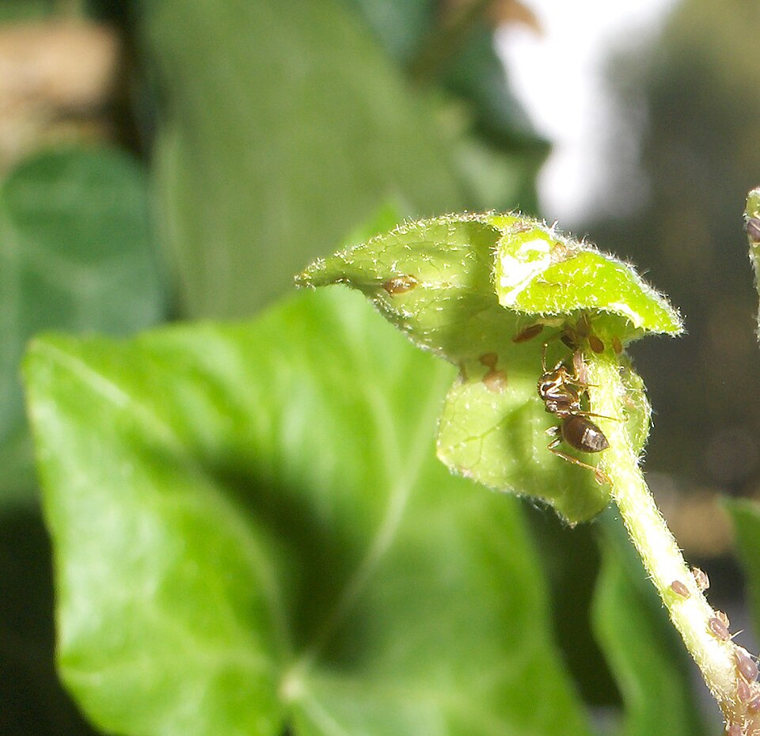
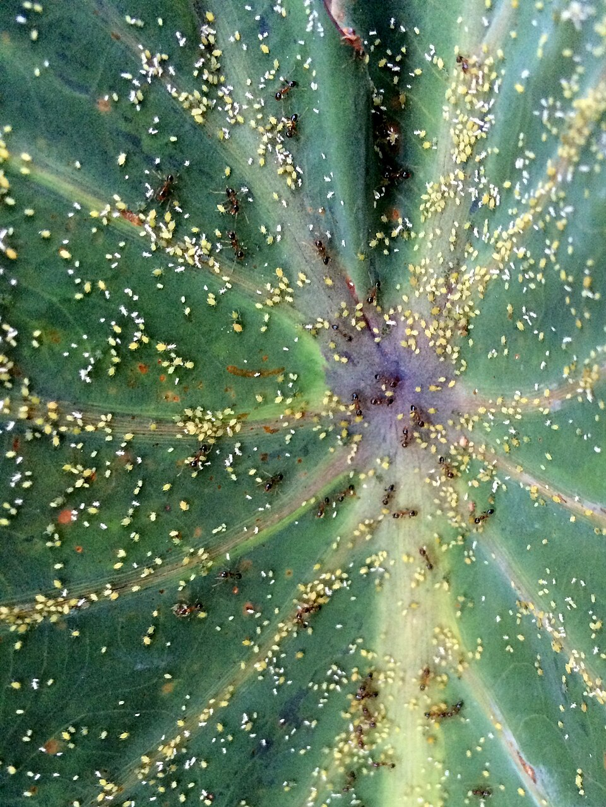
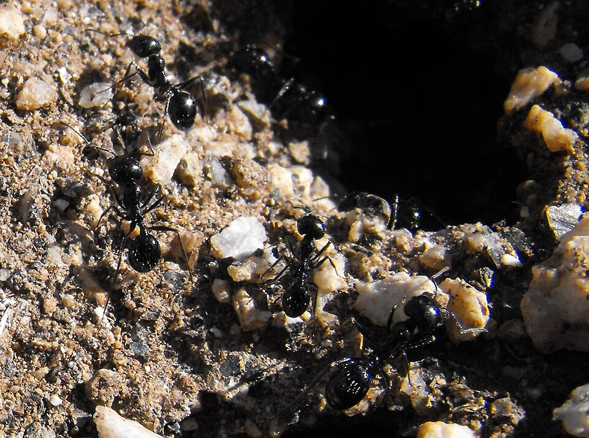

# Ecología alimentaria: cómo obtienen y procesan su alimento

Las hormigas no solo "comen" — han desarrollado estrategias sofisticadas para obtener, almacenar y distribuir alimento. Esta página explica los mecanismos detrás de cada tipo de dieta presente en las especies del repositorio.

---

## 1. Trofobiosis: el cultivo de mielada

### ¿Qué es la mielada?

La mielada es una secreción líquida azucarada producida por insectos hemípteros — principalmente **pulgones**, **cochinillas** y **escamas** — que se alimentan de la savia del floema de las plantas.

> 📷 Foto: Wikimedia Commons. [CC BY-SA 3.0](https://creativecommons.org/licenses/by-sa/3.0/).

### Composición de la mielada

La mielada no es simplemente "agua azucarada" — es un alimento complejo:

| Componente | Proporción aproximada | Detalle |
|-----------|----------------------|---------|
| **Azúcares** | 90–95% de sólidos | Sacarosa, fructosa, glucosa, melezitosa, trehalosa |
| **Trisacáridos** | 20–35% de azúcares | Melezitosa y rafinosa — preferidos por las hormigas |
| **Aminoácidos** | 1–5% | Glutamina y glutamato predominan; también asparagina, serina |
| **Minerales** | <1% | Potasio, calcio, magnesio, fosfato |
| **Vitaminas** | Trazas | Grupo B principalmente |

> Fuentes: Völkl et al. (1999), Fischer & Shingleton (2001), Kuhn et al. (2020).

La concentración de azúcares equivale a ~0.5 mol/L de sacarosa — más concentrada que la mayoría de néctares florales. El 69% de la sacarosa ingerida por el pulgón es asimilada; el resto se excreta como mielada.

### ¿Por qué las hormigas prefieren la mielada?

Los **trisacáridos** (melezitosa, rafinosa) constituyen el 20–35% de los azúcares en la mielada. Estos azúcares complejos:
- Atraen menos insectos oportunistas (avispas, moscas) que los azúcares simples como la sacarosa
- Se cree que los pulgones los producen específicamente para mantener la relación con las hormigas
- Cristalizan menos que la sacarosa en el buche social de la hormiga, facilitando la trofalaxia

### ¿Cómo "ordeñan" a los pulgones?

> 📷 Foto: Wikimedia Commons. [CC0 — Dominio público](https://creativecommons.org/publicdomain/zero/1.0/).

1. La hormiga se acerca al pulgón y lo **toca con sus antenas** — estimulando la secreción
2. El pulgón retrae sus patas traseras y expulsa una gota de mielada por el ano
3. La hormiga recoge la gota con sus mandíbulas y la almacena en su **buche social**
4. De vuelta al nido, la distribuye mediante **trofalaxia**

**Protección a cambio de alimento:**
- Las hormigas protegen a los pulgones de depredadores (mariquitas, crisopas, avispas parasitoides)
- Pueden mover pulgones a mejores plantas
- Algunas hormigas "podan" las alas de los pulgones para evitar que vuelen

### Especies del repositorio que practican trofobiosis

| Especie | Trófobiontes documentados |
|---------|--------------------------|
| *Camponotus morosus* | Pulgones, cochinillas, escamas |
| *Solenopsis gayi* | Pulgones y cochinillas |
| *Brachymyrmex giardii* | Pulgones, cochinillas |

---

## 2. Granivoría: semillas y pan de hormiga

### ¿Qué contienen las semillas?

Las semillas son alimento nutricionalmente completo — contienen los tres macronutrientes:

| Tipo de semilla | Carbohidratos | Grasas | Proteínas | Fibra |
|----------------|--------------|--------|-----------|-------|
| Alpiste | 55% | 6% | 14% | 6% |
| Linaza | 29% | 42% | 18% | 27% |
| Chía | 42% | 31% | 17% | 34% |
| Girasol (pelado) | 20% | 51% | 21% | 9% |
| Amapola | 28% | 42% | 18% | 20% |

> Por esto *Messor barbarus* puede subsistir **exclusivamente** con semillas — no necesita otra fuente de nutrientes.

### ¿Qué es el "pan de hormiga"?

> 📷 Foto: Wikimedia Commons — *Messor pergandei* en su nido. [CC BY-SA 3.0](https://creativecommons.org/licenses/by-sa/3.0/).

El llamado "pan de hormiga" es el producto del procesamiento mecánico de las semillas:

1. Las obreras menores traen las semillas al nido
2. Los **soldados** con sus mandíbulas enormes y músculos cefálicos hipertrofiados **trituran** la cáscara dura
3. El endospermo se separa de la testa
4. Las obreras mastican el endospermo mezclándolo con **saliva** que contiene enzimas digestivas
5. El resultado es una pasta húmeda y pegajosa — el "pan de hormiga"
6. Este pan se almacena en cámaras específicas o se distribuye directamente a las larvas

**La saliva contiene amilasas** que predigiieren el almidón de la semilla, convirtiéndolo en azúcares simples disponibles para las larvas. Es el equivalente exacto de la panificación humana: un proceso de digestión externa que transforma grano duro en alimento blando y asimilable.

### El granero

Las *Messor* mantienen cámaras diferenciadas:
- **Granero** — seco (10–30% humedad), donde almacenan semillas intactas. Las obreras las sacan al sol si detectan humedad excesiva
- **Cámara de procesamiento** — donde los soldados trituran
- **Cámara de cría** — húmeda (50–60%), donde el pan alimenta a las larvas

Si el granero se humedece, las semillas **germinan** dentro del nido → hongos → colapso. Las obreras tienen un comportamiento activo de "secado": sacan las semillas húmedas y las exponen al aire.

### Selección de semillas

*Messor barbarus* no recolecta al azar — selecciona según:
- **Tamaño** relativo al tamaño de la obrera
- **Valor nutritivo** (prefiere semillas oleaginosas)
- **Distancia** al nido (teoría del forrajeo óptimo)
- **Rugosidad del terreno** — en superficies ásperas, eligen cargas más pequeñas

> Fuente: Azcárate et al. (2005), Bernadou et al. (2016).

---

## 3. Depredación y carroñeo: proteínas

### ¿Por qué necesitan proteínas?

Las proteínas son esenciales para:
- **Crecimiento de larvas** — la cría es el principal consumidor de proteínas en la colonia
- **Producción de huevos** por la reina (ovogénesis)
- **Desarrollo muscular** en pupas

Las obreras adultas viven principalmente de azúcares para su metabolismo energético. Las proteínas se destinan casi exclusivamente a la cría.

### Composición nutricional de presas comunes

| Presa | Proteína | Grasa | Agua | Quitina |
|-------|---------|-------|------|---------|
| Grillo doméstico | 65% (peso seco) | 20% | 70% (fresco) | 8% |
| Tenebrio | 53% | 33% | 62% | 5% |
| Mosca doméstica | 54% | 15% | 70% | 11% |
| Cucaracha (*B. dubia*) | 61% | 26% | 65% | 7% |

> Valores en peso seco salvo donde se indica.

### Estrategias de caza

| Estrategia | Especies | Descripción |
|-----------|---------|-------------|
| **Forrajeo solitario** | *C. morosus*, *C. chilensis*, *C. fedtschenkoi* | Una obrera encuentra presa, la mata sola o la arrastra al nido |
| **Reclutamiento masivo** | *P. pallidula*, *C. scutellaris* | Una exploradora encuentra alimento, vuelve al nido reclutando decenas/cientos |
| **Carroñeo oportunista** | *C. morosus* | Aprovecha cadáveres de insectos, excrementos ricos en nitrógeno |

*Camponotus morosus* obtiene el 41% de su dieta de insectos (90.8% muertos, 9.2% vivos) y el 36% de excrementos de aves y reptiles — una estrategia carroñera inusual (Grez et al., 1986).

---

## 4. Trofalaxia: el sistema circulatorio social

### ¿Qué es?

La trofalaxia es la transferencia directa de alimento líquido entre individuos, típicamente boca a boca. Funciona como un **sistema circulatorio distribuido** que conecta a toda la colonia.

### ¿Cómo funciona?

1. Una forrajera regresa al nido con el **buche social** lleno de líquido azucarado
2. Otra obrera la toca con sus antenas — señal de solicitud
3. La donante regurgita una porción del contenido de su buche
4. La receptora lo almacena en su propio buche o lo pasa a otra obrera/larva

El buche social es un órgano pre-estomacal que actúa como **tanque de almacenamiento compartido**. El alimento ahí no se digiere — se mantiene disponible para compartir. Solo cuando la hormiga necesita energía para sí misma, pasa una porción al estómago verdadero (ventrículo).

### Velocidad de distribución

En una colonia de *Lasius niger* de 5,000 obreras, una sola forrajera puede distribuir alimento a **toda la colonia en menos de 24 horas** a través de cadenas de trofalaxia (Buffin et al., 2009; Greenwald et al., 2015).

### Trofalaxia y las "mieleras" de *Brachymyrmex giardii*

Las obreras repletas de *B. giardii* son una forma extrema de almacenamiento trofaláctico:
- Reciben tanto líquido azucarado que su gáster se distiende enormemente
- Se quedan colgando del techo como **tanques vivientes**
- Cuando la colonia necesita alimento, otras obreras las estimulan y ellas regurgitan
- Es la misma estrategia que *Myrmecocystus* (hormigas de miel norteamericanas), evolucionada independientemente

---

## 5. Agua azucarada vs. miel: ¿por qué recomendamos agua azucarada?

En cautiverio, el sustituto más seguro de la mielada natural es el **agua azucarada al 30%** (30 g de azúcar blanca en 100 ml de agua hervida).

| Criterio | Agua azucarada | Miel convencional | Miel ecológica certificada |
|---------|---------------|-------------------|---------------------------|
| Composición | Sacarosa pura + agua | Fructosa + glucosa + trazas | Fructosa + glucosa + trazas |
| Pesticidas | ❌ Ninguno | ⚠️ Posibles neonicotinoides, glifosato | ✅ Libre (certificado) |
| Riesgo para la colonia | Ninguno | **Alto** — trazas letales para colonias pequeñas | Bajo |
| Costo | Muy bajo | Medio | Alto |
| Disponibilidad | Universal | Universal | Limitada |

La miel convencional puede contener residuos de **neonicotinoides** (insecticidas sistémicos) en concentraciones de 1–10 ppb — suficientes para matar colonias pequeñas de hormigas. Solo usar miel con certificación orgánica garantizada.

---

## Referencias

- Völkl, W. et al. (1999). Ant-aphid mutualisms: the impact of honeydew production and honeydew sugar composition on ant preferences. *Oecologia*, 118: 483–491.
- Fischer, M.K. & Shingleton, A.W. (2001). Host plant and ants influence the honeydew sugar composition of aphids. *Functional Ecology*, 15: 544–550.
- Kuhn, G. et al. (2020). Sugar, amino acid and inorganic ion profiling of the honeydew from different hemipteran species. *PLoS ONE*, 15(1): e0228171.
- Azcárate, F.M. et al. (2005). Seed and fruit selection by harvester ants *Messor barbarus*. *Functional Ecology*, 19: 399–408.
- Bernadou, A. et al. (2016). Ergonomics of load transport in *Messor barbarus*. *Journal of Experimental Biology*, 219(18): 2920–2929.
- Grez, A.A., Simonetti, J.A. & Ipinza-Regla, J. (1986). Hábitos alimenticios de *Camponotus morosus* en Chile central. *Revista Chilena de Entomología*, 13: 51–54.
- Buffin, A. et al. (2009). Trophallaxis in *Lasius niger*. *Insectes Sociaux*, 56(3): 225–232.
- Greenwald, E. et al. (2015). Ant trophallactic networks: simultaneous measurement of interaction patterns and food dissemination. *Scientific Reports*, 5: 12496.
