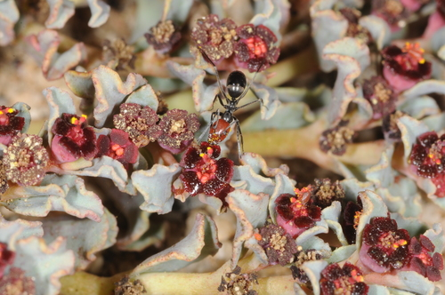

[Formicidae](../../../README.md) > [Dorymyrmex](../README.md) > goetschi

# *Dorymyrmex goetschi* — Ficha de especie

> **Hormiga volcán de cabeza roja** · Especie endémica de Chile · Nido con entrada en forma de volcán

## Fotografías

| Vista | Imagen |
|-------|--------|
| Natural |  |

> 📷 Foto: aacocucci ([iNaturalist](https://www.inaturalist.org/observations/54172115)). [CC BY](https://creativecommons.org/licenses/by/4.0/).

---

## Clasificación

| Campo | Valor |
|-------|-------|
| Familia | Formicidae |
| Subfamilia | Dolichoderinae |
| Género | *Dorymyrmex* |
| Especie | *goetschi* Goetsch, 1933 |
| Distribución natural | **Endémica de Chile** — Región de Antofagasta a Región de La Araucanía |
| Hábitat | Zonas abiertas y secas; nidos en suelo con entrada en forma de volcán |

---

## Historia del descubrimiento

Descrita por **Wilhelm Goetsch** en 1933. Goetsch fue un zoólogo alemán que estudió las hormigas de Chile durante los años 1930, publicando junto a Menozzi el trabajo *Die Ameisen Chiles* (Las hormigas de Chile) en 1935. El nombre *goetschi* es un epónimo del propio descriptor — algo inusual, probablemente nombrada por un colega o en una publicación posterior.

---

## Morfología

| Casta | Características |
|-------|-----------------|
| Obrera | **Negro con cabeza roja (ferrugínea)** — coloración bicolor muy distintiva |

**Morfología detallada (Snelling, 1975):**
- Cabeza **ferrugínea** (roja); tórax variable — a menudo parcial o completamente ferruginoso en pronoto, resto negruzco
- Setas superiores del psamóforo surgen en o por debajo del nivel del foramen occipital
- Frons y lóbulo frontal ligeramente a moderadamente brillantes, claramente rugosos y micropunteados
- Punteos progresivamente más densos hacia el occipucio
- Generalmente un par de sedas frontales presentes
- Primer tergo conspicuamente pubescente lateralmente, más escasa en el medio
- En perfil: mesonoto generalmente anguloso en la base en un cuarto

---

## Comportamiento

| Rasgo | Descripción |
|-------|-------------|
| Agresividad | Desconocida — sin aguijón (Dolichoderinae) |
| Actividad | Probablemente diurna (género de zonas abiertas y soleadas) |
| Forrajeo | Cooperativo — forma columnas (típico del género) |
| Defensa | Sin picadura; secreciones químicas volátiles |
| Nido | Entrada con forma de **volcán** — rasgo diagnóstico de la especie |

---

## Biología

> ⚠️ **La biología de esta especie es poco conocida.** Los datos de cría son inferidos del comportamiento típico del género *Dorymyrmex*.

### Nidificación
- Nidos en **suelo** con entrada característica en **forma de volcán** (montículo cónico)
- Zonas abiertas, secas y soleadas

### Tamaño de colonia
- No documentado específicamente
- Tamaño medio del género *Dorymyrmex*: ~5,000 individuos

---

## Cómo encontrarla en terreno

| Dato | Detalle |
|------|---------|
| Hábitat | Zonas abiertas, secas y soleadas; nidos en suelo con entrada en forma de **volcán** (montículo cónico) |
| Regiones | Antofagasta a La Araucanía |
| Señales del nido | **Montículo cónico de tierra** con abertura central — visible a distancia en terreno despejado |
| Mejor hora | Diurna — activa en días soleados y cálidos |
| Época de reinas | Desconocida con precisión; probablemente primavera-verano |

```
Ene · Feb · Mar · Abr · May · Jun · Jul · Ago · Sep · Oct · Nov · Dic
──────────────────────────────────────────────────────────────────────
                                                🐜?   🐜?   🐜?   🐜?
```
| Vegetación indicadora | Pastizales secos, campos abiertos sin cobertura vegetal densa, bordes de camino |
| Confirmación visual | Hormiga negra con cabeza roja/ferrugínea. Sin aguijón. Forman columnas de forrajeo |

**Consejos de búsqueda:**
- Buscar en terreno abierto y seco — campos, bordes de senderos con suelo expuesto al sol
- Los nidos con forma de volcán son visibles desde lejos — observar sin perturbar
- Activas durante el día con sol — seguir columnas de forrajeo para localizar el nido
- No pican (Dolichoderinae sin aguijón) pero secretan sustancias con olor
- Para obtener reina: esperar vuelo nupcial y recoger reinas sin alas del suelo

---

## Fundación

| Dato | Valor |
|------|-------|
| Tipo | **Claustral** — la reina no necesita alimento hasta las primeras obreras |
| Pleometrosis | No documentada — fundar con una sola reina |
| Nanitics esperados | 3–5 obreras en la primera generación |
| Tiempo hasta primeras obreras | 6–10 semanas (estimado) |
| Tubo de ensayo | 16×150 mm estándar |
| Dificultad de fundación | Desconocida — especie poco criada |

**Consejos:**
- Especie endémica poco disponible en el mercado. Las reinas probablemente se encuentran tras vuelos nupciales de verano.
- Se asume fundación claustral como el resto de *Dorymyrmex* — no alimentar hasta las primeras obreras.
- Mantener el tubo relativamente seco (sin exceso de agua) dado que es una especie de hábitats áridos.

---

## Alimentación

Basado en el comportamiento típico del género *Dorymyrmex* (omnívoro):

### Proteínas (2–3 veces por semana)
- Insectos pequeños vivos o muertos
- Carroña de artrópodos

### Azúcares (cada 2–3 días)
- Agua azucarada al 30% — opción principal, segura y siempre disponible
- Néctar artificial
- Miel ecológica certificada diluida (opcional — solo si se tiene certeza de que está libre de pesticidas)

### Agua
- Siempre disponible. Bebedero con algodón húmedo.

---

## Parámetros de cría

| Parámetro | Valor estimado |
|-----------|---------------|
| Temperatura nido | 20–26 °C |
| Humedad nido | 35–50% — especie de hábitat seco |
| Hibernación | Recomendable diapausa suave (12–16 °C, **junio–agosto**) |

---

## Nidificación en cautiverio

- Nidos de acrílico, yeso o impresos en 3D (PETG) con cámaras diferenciadas
- Tubo de ensayo para fundación
- Nido con gradiente seco

**Ventilación:** Necesaria. Como Dolichoderinae, produce **secreciones químicas volátiles** (terpenoides) como defensa. Asegurar flujo de aire pasivo.

---

## Esperanza de vida

| Casta | Estimación |
|-------|-----------|
| Reina | Desconocido |
| Obreras | Desconocido |

> Sin datos para el género *Dorymyrmex*. Probablemente similar a otras Dolichoderinae (reina 5–15 años, obreras 1–2 años).

---

## Dificultad de cría

| Criterio | Valoración |
|----------|-----------|
| Dificultad general | ⭐⭐ Intermedio |
| Velocidad de crecimiento | Desconocida |
| Resistencia | Desconocida |
| Espectacularidad | 🌟🌟🌟 (cabeza roja, nido volcánico) |

> ⚠️ **Especie endémica.** No liberar individuos fuera de su rango natural.

---

> 💡 **¿Sabías que?** *D. goetschi* construye nidos con entrada en forma de **volcán** — montículos cónicos de tierra que la identifican a distancia. Wilhelm Goetsch, que la describió en 1933, fue uno de los primeros científicos en dedicar un estudio completo a las hormigas de Chile.

> 📖 Los términos técnicos de esta ficha están explicados en el [Glosario](../../../../../glosario.md).

---

## Referencias

- Goetsch, W. (1933). Descripción de *Dorymyrmex goetschi*.
- Goetsch, W. & Menozzi, C. (1935). Die Ameisen Chiles. *Konowia* 14: 94–102.
- Snelling, R.R. & Hunt, J.H. (1975). The ants of Chile (Hymenoptera: Formicidae). *Rev. Chil. Entomol.* 9: 63–129.
- AntWiki: [Dorymyrmex goetschi](https://www.antwiki.org/wiki/Dorymyrmex_goetschi)
- *Historia de las Hormigas de Chile* (fuente principal de este repositorio)
