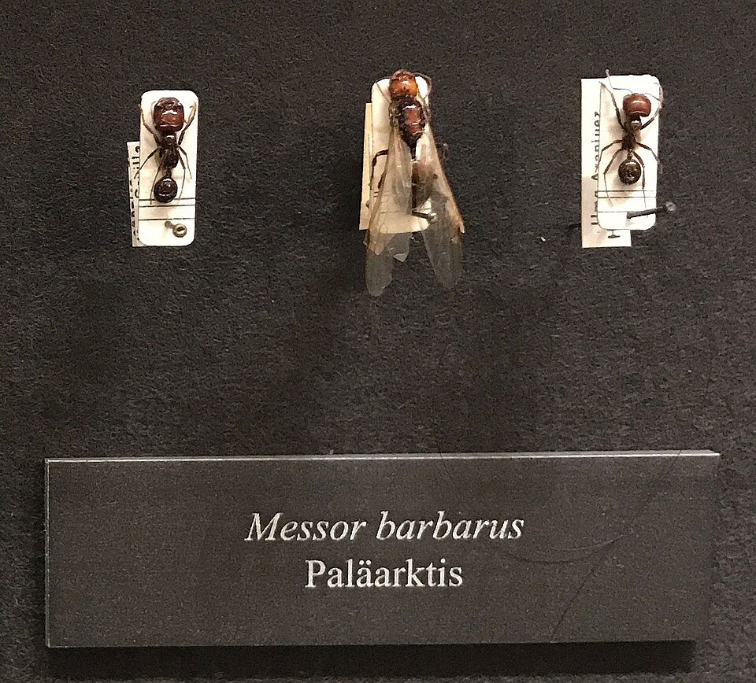

[Formicidae](../../../README.md) > [Messor](../README.md) > barbarus

# *Messor barbarus* — Ficha de especie

> **Hormiga cosechadora mediterránea** · La especie granívora más popular en mirmecología, ideal para principiantes

## Fotografías

| Vista | Imagen |
|-------|--------|
| Natural |  |

> 📷 Foto: Wikimedia Commons. [CC BY-SA 4.0](https://creativecommons.org/licenses/by-sa/4.0/).

---

## Clasificación

| Campo | Valor |
|-------|-------|
| Familia | Formicidae |
| Subfamilia | Myrmicinae |
| Género | *Messor* |
| Especie | *barbarus* Linnaeus, 1767 |
| Distribución natural | Sur de Europa (España, Francia, Italia) y Norte de África |
| Hábitat | Zonas abiertas y soleadas: pastizales, campos agrícolas, laderas secas mediterráneas |

---

## Morfología y polimorfismo

Especie **altamente polimorfa** con una de las variaciones de tamaño más extremas del hobby. Los soldados pueden igualar el tamaño de la reina.

| Casta | Tamaño | Características |
|-------|--------|-----------------|
| Obrera menor | 3–5 mm | Forrajeras principales, recolección de semillas |
| Obrera media | 5–9 mm | Transporte y procesado de semillas |
| Soldado (major) | 10–14 mm | **Cabeza roja/caoba enorme**, tritura semillas duras |
| Reina | 14–17 mm | Negra, gáster voluminoso |
| Macho | 8–11 mm | Alas, efímero |

**Coloración:** Cuerpo negro con la cabeza de los soldados en **rojo intenso o caoba** — rasgo diagnóstico inconfundible. Las obreras menores son completamente negras.

> La aparición del primer soldado de cabeza roja es uno de los hitos más celebrados en el hobby de la mirmecología.

---

## Alimentación

*Messor barbarus* es **granívora** — obtiene todos los nutrientes necesarios únicamente de semillas. Es la única especie de este repositorio que no requiere insectos de forma obligatoria.

### Semillas (base de la dieta — siempre disponibles)
- **Semillas pequeñas preferidas:** alpiste, linaza, semilla de hierba, colza, chía, amapola
- **Semillas medianas:** girasol sin cáscara, cáñamo, quinoa
- Ofrecer variedad — en naturaleza seleccionan según disponibilidad y distancia al nido (teoría del forrajeo óptimo)
- Guardar en granero seco dentro del nido; las obreras regulan la humedad para evitar germinación

### Proteínas adicionales (opcional, 1–2 veces por semana en colonias grandes)
- Insectos pequeños: grillos, moscas, tenebrios
- Útil para acelerar el crecimiento de la cría en colonias establecidas

### Azúcares (opcional, 1–2 veces por semana)
- Agua azucarada al 30% — opción principal, segura y siempre disponible
- Néctar artificial
- Miel ecológica certificada diluida (opcional — solo si se tiene certeza de que está libre de pesticidas)

### Agua
- Siempre disponible. Bebedero con algodón húmedo.

> **Ventaja clave para criadores:** La dieta basada en semillas hace que *M. barbarus* sea mucho más fácil de mantener que especies que requieren insectos frescos diariamente. Un bote de alpiste dura semanas.

---

## Fundación

| Dato | Valor |
|------|-------|
| Tipo | **Claustral completa** — la reina no necesita alimento |
| Pleometrosis | No recomendada |
| Nanitics esperados | 5–15 obreras en la primera generación |
| Tiempo hasta primeras obreras | 3–5 semanas a 24–26 °C |
| Tubo de ensayo | 16×150 mm estándar |
| Dificultad de fundación | Muy baja — una de las más fáciles del hobby |

**Consejos:**
- Fundación facilísima. La reina es grande, resistente y tiene reservas musculares abundantes.
- Las primeras obreras emergen en ~4 semanas — mucho más rápido que *Camponotus*.
- Los primeros soldados aparecen muy pronto (30–50 obreras) — un hito emocionante.
- Puede fundar en cualquier época si la temperatura es adecuada (22–26 °C).
- Opcional: ofrecer una semilla de alpiste o chía el primer día (aunque no es necesaria).

---

## Ritmo de crecimiento

Especie de **crecimiento rápido** comparada con *Camponotus* — una de las más rápidas del hobby.

| Fase | Duración | Tamaño de colonia |
|------|----------|-------------------|
| Fundación claustral | 4–6 semanas | 1 reina |
| Primeras obreras | 4–6 semanas | 5–20 obreras |
| Fin del año 1 | — | 100–300 obreras |
| Año 2–3 | — | 300–1,000 obreras |
| Colonia madura | 3–5 años | 1,000–5,000+ obreras |

**Ciclo huevo → adulto:** ~4–6 semanas a temperatura óptima.

> Con temperatura adecuada el crecimiento es **exponencial** — puede alcanzar 1,000 obreras en pocos años.

---

## Parámetros de cría

### Temperatura

| Zona | Temperatura ideal | Rango tolerable |
|------|-----------------|-----------------|
| Nido | 22–26 °C | 20–30 °C |
| Área de forrajeo | 22–28 °C | 18–32 °C |

> Especie mediterránea — tolera bien el calor. Temperaturas bajas ralentizan la puesta de la reina.

### Humedad

| Zona | Humedad ideal |
|------|--------------|
| Cámara de cría | 50–60% |
| Granero (semillas) | 10–30% — **debe estar seco** para evitar germinación |
| Área de forrajeo | 30–50% |

> El gradiente de humedad es clave: cámara de cría húmeda + granero seco. Los nidos con cámaras diferenciadas (Ytong, yeso) facilitan esto.

### Hibernación / Diapausa
- **Requiere hibernación.** De **mayo a agosto** (~4 meses).
- Temperatura ideal: **12–16 °C** (nunca bajar de 10 °C).
- La reina detiene la puesta — fase de descanso esencial para su longevidad.
- Se puede omitir la primera hibernación sin daño significativo para colonias muy jóvenes.
- Mantener humedad y ofrecer agua durante la hibernación; reducir o eliminar semillas.

---

## Tamaño de colonia

| Etapa | Obreras |
|-------|---------|
| Mínimo para trasladar al nido | ~20–30 |
| Primeros soldados | ~100–200 |
| Colonia funcional | ~300–500 |
| Colonia madura en cautiverio | 1,000–5,000 |
| Máximo reportado | 10,000+ |

---

## Nidificación

- **En naturaleza:** Suelo profundo bajo zonas soleadas; nidos con cámaras diferenciadas para cría y graneros.
- **En cautiverio — materiales recomendados:**
  - ✅ Ytong (hormigón aireado) — favorito para esta especie; retiene humedad, las hormigas pueden excavarlo
  - ✅ Yeso/escayola — buena retención de humedad, económico
  - ✅ Acrílico — buena visibilidad
  - ✅ Impresión 3D (PETG) — permite diseñar cámaras a medida, resistente a humedad y calor
  - ✅ Setup naturalístico con tierra — replica el hábitat natural
  - ⚠️ Si usas Ytong, enciérralo en un contenedor — pueden excavarlo y escapar

**Ventilación:** Estándar. Como Myrmicinae, no produce ácido fórmico volátil. La ventilación principal es para evitar moho en el granero y condensación en las cámaras de cría. Las semillas húmedas + nido cerrado = hongos garantizados.

> Necesitan cámaras con **diferente nivel de humedad**: granero seco + zona de cría húmeda. Elegir nidos que permitan este gradiente.

---

## Vuelo nupcial

- **Época:** Primavera — de finales de marzo a junio.
- **Disparadores:** Temperatura alta, humedad post-lluvia, días largos.
- **Fundación:** Completamente claustral. La reina no necesita alimento hasta que emergen las primeras obreras; usa sus reservas musculares alares como fuente de proteína.

---

## Historia del descubrimiento

Descrita por **Carl Linnaeus** en 1767 en la duodécima edición de su *Systema Naturae* como *Formica barbara*. Es una de las hormigas más tempranamente documentadas en la historia de la entomología. El nombre *barbarus* significa "bárbaro" o "extranjero" en latín — probablemente por su origen norteafricano/mediterráneo visto desde la perspectiva nórdica de Linneo. Posteriormente transferida al género *Messor* por Forel.

---

## Comportamiento

| Rasgo | Descripción |
|-------|-------------|
| Agresividad | Baja con el criador; moderada entre colonias |
| Actividad | **Diurna** — activas durante el día en condiciones cálidas; reducen actividad con calor extremo |
| Forrajeo | **Columnas organizadas** — forman filas densas hacia fuentes de semillas |
| Formación de filas | ✅ Sí — uno de los comportamientos más vistosos del hobby |
| Selección de alimento | Óptima — eligen semillas según tamaño, valor nutritivo y distancia (Azcárate et al., 2005) |
| Escape | Muy bajo — torpes y malas escaladoras |
| Sensibilidad a vibraciones | Baja — especie robusta y tolerante |
| Comportamiento especial | "Pan de hormiga" — los soldados trituran semillas duras; las obreras procesan la pasta |

---

## Esperanza de vida

| Casta | Estimación |
|-------|-----------|
| Reina | 15–20 años |
| Obreras | 1–3 años |

> Datos basados en el género *Messor*. Reinas de *M. barbarus* pueden vivir más de 15 años en cautiverio con condiciones óptimas.

---

## Dificultad de cría

| Criterio | Valoración |
|----------|-----------|
| Dificultad general | ⭐ Principiante |
| Velocidad de crecimiento | 🚀 Rápida |
| Resistencia | 💪💪 Muy alta |
| Espectacularidad | 🌟🌟🌟🌟🌟 (soldados de cabeza roja, columnas de forrajeo) |

---

## Errores comunes

1. **Usar miel convencional sin certificación** → puede contener pesticidas letales. Preferir agua azucarada como fuente de carbohidratos.
2. **Granero húmedo** → las semillas germinan dentro del nido, generando hongos y estrés. Mantener el granero seco.
3. **Omitir la hibernación** → sin diapausa la reina se agota prematuramente y acorta su vida.
4. **Temperatura demasiado baja fuera de hibernación** → ralentiza el crecimiento y la puesta.
5. **Nido demasiado grande al inicio** → empezar con espacio proporcional a la colonia.
6. **No ofrecer variedad de semillas** → la monotonía dietética reduce el rendimiento de la cría.

---

> 💡 **¿Sabías que?** *M. barbarus* "inventó" la panadería: los soldados con cabeza roja trituran semillas duras con sus mandíbulas gigantes para crear una pasta llamada "pan de hormiga" que alimenta a toda la colonia. Linnaeus la describió en 1767 — una de las primeras hormigas en recibir nombre científico.

> 📖 Los términos técnicos de esta ficha están explicados en el [Glosario](../../../../../glosario.md).

---

## Referencias

- Linnaeus, C. (1767). Descripción original de *Formica barbara*.
- Azcárate, F.M. et al. (2005). Seed and fruit selection by harvester ants *Messor barbarus* in Mediterranean grassland. *Functional Ecology*, 19: 399–408.
- Brumaants.com: [How to care for Messor barbarus](https://brumaants.com/how-to-care-for-messor-barbarus)
- Ant-Shack.com: [Messor barbarus care sheet](https://www.ant-shack.com/pages/encyclopedia-entry/messor-barbarus)
- AntWiki: [Messor barbarus](https://www.antwiki.org/wiki/Messor_barbarus)
