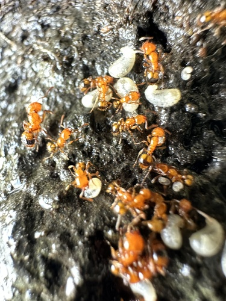

[Formicidae](../../../README.md) > [Monomorium](../README.md) > latastei

# *Monomorium latastei* — Ficha de especie

> **Hormiga naranja endémica de Chile central** · Especie poco estudiada, distribución restringida

## Fotografías

| Vista | Imagen |
|-------|--------|
| Natural |  |

> 📷 Foto: nitsuga74 ([iNaturalist](https://www.inaturalist.org/observations/171994614)). [CC BY](https://creativecommons.org/licenses/by/4.0/).

---

## Clasificación

| Campo | Valor |
|-------|-------|
| Familia | Formicidae |
| Subfamilia | Myrmicinae |
| Género | *Monomorium* |
| Especie | *latastei* Emery, 1895 |
| Distribución natural | **Endémica de Chile** — Región Metropolitana a Región de La Araucanía |
| Hábitat | No documentado; suelo, bajo piedras (típico del género) |

> El nombre *latastei* fue otorgado en honor al naturalista Fernand Lataste, quien trabajó en Chile a fines del siglo XIX.

---

## Morfología

Especie de tamaño pequeño, típica del género *Monomorium*. Presenta **polimorfismo** con obreras menores, mayores y soldados documentados.

| Casta | Características |
|-------|-----------------|
| Obrera | **Naranja brillante** con gáster negro — coloración bicolor muy distintiva |
| Soldado (major) | Cabeza más grande, misma coloración |
| Reina | Documentada en AntWeb; coloración similar |

**Morfología detallada (Snelling, 1975):**
- Cabeza del **mismo color que el tórax** (naranja); gáster más oscuro (negro)
- Propodeo claramente angulado, generalmente con **proyecciones triangulares distintas** — rasgo diagnóstico clave
- Área malar generalmente inferior a 1.2× el largo del ojo (0.77–1.20×)
- Antenómero penúltimo de 0.77 a 1.20 veces más largo que ancho

> **Identificación:** Si la cabeza es del mismo color que el gáster, el área malar debe ser al menos 1.10× el largo del ojo para distinguirla de especies similares.

---

## Biología

> ⚠️ **La biología de esta especie es prácticamente desconocida.** El libro *Historia de las Hormigas de Chile* indica explícitamente: *"No se conoce sobre la biología de esta especie."* Los datos de cría a continuación son inferidos del comportamiento típico del género *Monomorium* en Chile.

---

## Cómo encontrarla en terreno

| Dato | Detalle |
|------|---------|
| Hábitat | Suelo bajo piedras, zonas de Chile mediterráneo central |
| Regiones | Región Metropolitana a La Araucanía |
| Señales del nido | Bajo piedras en suelo — sin estructura externa visible |
| Mejor hora | Probablemente diurna |
| Época de reinas | Desconocida |

```
Ene · Feb · Mar · Abr · May · Jun · Jul · Ago · Sep · Oct · Nov · Dic
──────────────────────────────────────────────────────────────────────
 ?     ?     ?     ?     ?     ?     ?     ?     ?     ?     ?     ?
```
| Vegetación indicadora | Matorral esclerófilo, bosque esclerófilo costero |
| Confirmación visual | Hormiga pequeña **naranja brillante con gáster negro** (bicolor muy distintiva). Propodeo con proyecciones triangulares (lupa) |

**Consejos de búsqueda:**
- Observar superficies de piedras en zonas de matorral esclerófilo — la coloración naranja brillante la hace inconfundible
- Distribución más amplia que *M. cekalovici* — buscar desde Santiago hasta La Araucanía
- Distinguir de *M. cekalovici*: en *latastei* la cabeza es naranja (mismo color que tórax); en *cekalovici* la cabeza es oscura
- Para obtener reina: esperar vuelo nupcial y buscar reinas sin alas caminando en superficies abiertas — no perturbar colonias

---

## Fundación

| Dato | Valor |
|------|-------|
| Tipo | **Probablemente claustral** (típico de Myrmicinae pequeñas) |
| Pleometrosis | No documentada |
| Nanitics esperados | 3–8 obreras (estimado) |
| Tiempo hasta primeras obreras | 4–6 semanas (estimado) |
| Tubo de ensayo | 16×150 mm estándar |
| Dificultad de fundación | Desconocida — especie rara y poco criada |

**Consejos:**
- Especie endémica — reinas muy difíciles de obtener.
- Asumir fundación claustral. No alimentar hasta las primeras obreras.
- Mantener a 22–25 °C y humedad moderada (50–60%).
- En caso de no conocer si la reina fue fecundada: ofrecer microgota de agua azucarada por precaución.

---

## Alimentación

Basado en el comportamiento típico del género:

### Proteínas (2–3 veces por semana)
- Insectos pequeños vivos o congelados (moscas, tenebrios pequeños, grillos)

### Azúcares (cada 2–3 días)
- Agua azucarada al 30% — opción principal, segura y siempre disponible
- Néctar artificial
- Miel ecológica certificada diluida (opcional — solo si se tiene certeza de que está libre de pesticidas)

### Agua
- Siempre disponible. Bebedero con algodón húmedo.

---

## Parámetros de cría

Estimados según el género y el clima de su distribución natural (Chile mediterráneo central):

| Parámetro | Valor estimado |
|-----------|---------------|
| Temperatura nido | 20–25 °C |
| Humedad nido | 50–65% |
| Hibernación | Recomendable diapausa suave (12–16 °C, **junio–agosto**) |

---

## Tamaño de colonia

No documentado específicamente. Estimado según el género: colonias de decenas a pocos cientos de individuos.

---

## Nidificación

- **En naturaleza:** No documentado. Probablemente suelo y bajo piedras, típico del género en Chile central.
- **En cautiverio:** Nidos de acrílico, yeso o impresos en 3D (PETG). Tubo de ensayo para fundación.

**Ventilación:** Estándar. Como Myrmicinae, no produce ácido fórmico volátil. Ventilación necesaria para evitar condensación y hongos, sin riesgo de gases irritantes.

---

## Historia del descubrimiento

Descrita por **Carlo Emery** en 1895. El nombre *latastei* honra a **Fernand Lataste** (1847–1934), herpetólogo y naturalista francés que vivió y trabajó en Chile entre 1890 y 1910 como profesor en la Universidad de Chile. Lataste realizó importantes colectas de fauna chilena y fue un naturalista prolífico que describió numerosas especies de reptiles y anfibios chilenos.

---

## Comportamiento

| Rasgo | Descripción |
|-------|-------------|
| Agresividad | Desconocida — el género *Monomorium* suele ser de agresividad baja-media |
| Actividad | Desconocida — probablemente diurna (típico del género en zonas mediterráneas) |
| Forrajeo | Probablemente cooperativo en columnas pequeñas |
| Defensa | Con aguijón funcional (Myrmicinae) — picadura leve |
| Escape | Bajo (hormigas pequeñas) |

---

## Esperanza de vida

| Casta | Estimación |
|-------|-----------|
| Reina | 5–10 años (estimado) |
| Obreras | < 1 año |

> Sin datos específicos para *M. latastei*. Estimación basada en el género *Monomorium*.

---

## Dificultad de cría

| Criterio | Valoración |
|----------|-----------|
| Dificultad general | ⭐⭐ Intermedio (escasa información disponible) |
| Velocidad de crecimiento | Desconocida |
| Resistencia | Desconocida |
| Espectacularidad | 🌟🌟🌟🌟 (coloración naranja/negro muy llamativa) |

> ⚠️ **Nota para criadores:** Especie endémica con distribución restringida al Chile mediterráneo central. No liberar individuos fuera de su rango natural.

---

## Comparación con *M. cekalovici*

Ambas son *Monomorium* endémicas de Chile central con biología poco conocida, pero se distinguen fácilmente:

| Característica | *M. latastei* | *M. cekalovici* |
|----------------|--------------|-----------------|
| Coloración | Naranja brillante + gáster negro | Cabeza y gáster marrón oscuro/negro + tórax naranja |
| Propodeo | Con proyecciones triangulares distintas | Redondeado, sin angulaciones |
| Distribución | R. Metropolitana – La Araucanía | Valparaíso – O'Higgins |

---

## Estado de conocimiento

Se necesitan estudios sobre:
- Tamaño y estructura de colonias
- Comportamiento de forrajeo y dieta en naturaleza
- Ciclo reproductivo y vuelo nupcial
- Requerimientos específicos de temperatura y humedad

---

> 💡 **¿Sabías que?** Fernand Lataste — en cuyo honor se nombró esta especie — fue un herpetólogo francés que vivió en Chile 20 años (1890–1910) y describió numerosos reptiles y anfibios chilenos. Es uno de los pocos naturalistas extranjeros que se radicó permanentemente en Chile para estudiar su fauna.

> 📖 Los términos técnicos de esta ficha están explicados en el [Glosario](../../../../../glosario.md).

---

## Referencias

- Emery, C. (1895). Descripción de *Monomorium latastei*.
- Snelling, R.R. & Hunt, J.H. (1975). The ants of Chile (Hymenoptera: Formicidae). *Rev. Chil. Entomol.* 9: 63–129.
- AntWiki: [Monomorium latastei](https://www.antwiki.org/wiki/Monomorium_latastei)
- *Historia de las Hormigas de Chile* (fuente principal de este repositorio)
